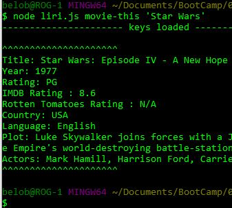

# liri-node-app
A command line based Language Interpretation and Recognition Interface node app.

***** YOU WILL NEED TO SUPPLY YOUR OWN KEYS VIA A .env FILE TO RUN THIS ON YOUR OWN MACHINE ***********
Possible commands:
* my-tweets
	 * Returns the last 20 tweets for the screen name specified in liri.js
* spotify-this-song <'song name'>
	* returns info on the song specified
* movie-this <'movie title'>
	* returns info on the movie specified
* do-what-it-says
	* does what the random.txt file says

This app logs data returned by each command to the log.txt file

